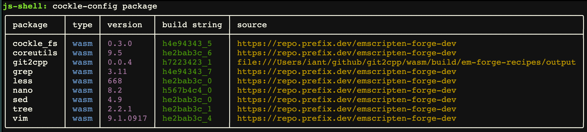

# Building and testing git2cpp in WebAssembly

This directory contains everything needed to build the local `git2cpp` source code as an
WebAssembly [Emscripten-forge](https://emscripten-forge.org/) package, create local
[cockle](https://github.com/jupyterlite/cockle) and
[JupyterLite terminal](https://github.com/jupyterlite/terminal) deployments that run in a browser,
and test the WebAssembly build.

It works on Linux and macOS but not Windows.

There are 5 sub-directories:

- `recipe`: build local `git2cpp` source code into an Emscripten-forge package.
- `cockle-deploy`: create a `cockle` deployment in the `serve` directory.
- `lite-deploy`: create a JupyterLite `terminal` deployment in the `serve` directory.
- `serve`: where the two deployments are served from.
- `test`: test the WebAssembly build.

## Build and deploy

The build, deploy and test process uses a separate `micromamba` environment defined in
`wasm-environment.yml`. To set this up use from within this directory:

```bash
micromamba create -f wasm-environment.yml
micromamba activate git2cpp-wasm
```

Then to build the WebAssembly package, both deployments and the testing resources use:

```bash
cmake .
make
```

The available `cmake` options are:

- `USE_RECIPE_PATCHES`: Use patches from emscripten-forge recipe or not, default is `ON`
- `USE_COCKLE_RELEASE`: Use latest cockle release rather than repo main branch, default is `OFF`

For example, to run `cmake` but without using emscripten-forge recipe patches use:

```bash
cmake . -DUSE_RECIPE_PATCHES=OFF
make
```

The built emscripten-forge package will be file named something like `git2cpp-0.0.5-h7223423_1.tar.bz2`
in the directory `recipe/em-force-recipes/output/emscripten-wasm32`.

The local deployments in the `serve` directory can be manually checked using:

```bash
make serve
```

and open a web browser at http://localhost:8080/. Confirm that the local build of `git2cpp` is being
used in the two deployments by running `cockle-config package` at the command line, the output
should be something like:



Note that the `source` for the `git2cpp` package is the local filesystem rather than from
`prefix.dev`. The version number of `git2cpp` in this table is not necessarily correct as it is the
version number of the current Emscripten-forge recipe rather than the version of the local `git2cpp`
source code which can be checked using `git2cpp -v` at the `cockle`/`terminal` command line.

If you want to remotely access git servers using `git2cpp` subcommands such as `clone`, `fetch`
and `push`, then serve with a local CORS proxy using:

```bash
make serve-with-cors
```

which will use the CORS proxy on `http://localhost:8881/`.

## Rebuild

After making changes to the local `git2cpp` source code you can rebuild the WebAssembly package,
both deployments and test code using from the `wasm` directory:

```bash
make rebuild
```

## Test

To test the WebAssembly build use from the `wasm` directory:

```bash
make test
```

This runs (some of) the tests in the top-level `test` directory with various monkey patching so that
`git2cpp` commands are executed in the browser.
The tests that are run are defined in the function `pytest_ignore_collect` in `conftest_wasm.py`.
If there are problems running the tests then ensure you have the latest `playwright` browser installed:

```bash
playwright install chromium
```

You can run a specific test from the top-level `test` directory (not the `wasm/test` directory)
using:

```bash
GIT2CPP_TEST_WASM=1 pytest -v test_git.py::test_version
```

### Manually running the test servers

If wasm tests are failing it can be helpful to run the test servers and manually run `cockle`
commands to help understand the problem. To do this use:

```bash
cd wasm/test
npm run serve
```

This will start both the test server on port 8000 and the CORS server on port 8881. Open a browser
at http://localhost:8000/ and to run a command such as `ls -l` open the dev console and enter the
following at the prompt: `await window.cockle.shellRun('ls -al')`. The generated output will appear
in a new `<div>` in the web page in a format similar to that returned by Python's
`subprocess.run()`.
